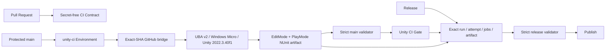

# アーキテクチャ

Motion Take Studio は、Play Mode にだけ存在する一時オブジェクトと、再利用できる耐久データを
分離します。

```text
OpenVR Reflection Provider / custom ITrackerPoseProvider
  -> タイムスタンプ付き TrackerFrame
  -> 一時的な Humanoid（任意の Avatar 処理後を含む）+ MotionCaptureRig
  -> Tracker IK HumanPose -> Automatic HumanPose
  -> append-only Recovery Journal
  -> Review / 非破壊 MotionEditRecipe
  -> versioned Humanoid AnimationClip
```

## Capture ライフサイクル

EditorWindow は `IMotionTakeStudioSession` にだけ依存し、標準実装は
`MotionCaptureCoordinator` です。状態は Idle、Preparing、Ready、Recording、Reviewing、Saving、
Error を遷移します。

Prepare 時に選択したシーンオブジェクトを additive Scene へ複製し、セッション ID と元オブジェクトの
`GlobalObjectId` を保持します。NDMF は任意です。NDMF Apply on Play と互換の完了通知を安全に利用できる
場合だけ Clone に `AvatarActivator` を追加し、処理完了後の Root を使います。利用できない場合は通常の
Humanoid Clone を使います。一度任意処理を開始した場合、完了前に通常 Clone へフォールバックしません。
Capture 対象は直接参照、または不活性な `MotionCaptureAvatarMarker` で識別し、名前や `(Clone)`
接尾辞には依存しません。

NDMF や VRChat 側の処理が Animator を再生成する可能性があるため、Coordinator は同じ Animator と
必要 Humanoid Bone が 2 Player Frame 連続で安定するまで待ち、参照を取り直してから Ready にします。

## Tracker と Capture Rig

標準 Provider は SteamVR Unity Plugin の `Valve.VR.OpenVR` を Reflection で発見します。そのため
SteamVR は基本アセンブリのコンパイル時依存ではありません。`ITrackerPoseProvider` を注入すると
トラッキング実装を置き換えられますが、Record にはどの Provider でも有効な
Head／LeftHand／RightHand が必要です。

HMD と左右 Controller のロールは OpenVR の Device Class / Controller Role から決めます。
Generic Tracker は Ready 時のウィンドウまたは API からシリアル番号へ明示ロールを設定できます。
永続設定アセットはありません。
未設定時の自動ロールはデバイス順の暫定値です。

`MotionCaptureRig` は Tracker を収録用 Humanoid へ適用し、Filtering、Root 補正、Foot Lock、
Two-Bone IK を実行してから HumanPose をサンプルします。Manual Recipe の IK は Capture 後の
`MotionTakePreviewDriver` が最後に適用します。

## 耐久データ

Tracker Pose と HumanPose はシリアライズ可能な値へコピーします。Play Mode の一時
AnimatorController、Avatar、Material、Component、Transform 参照を Recovery や `.mttake` へ
保存しません。

`.mttake` は JSON を `MotionTakeImporter` が `MotionTakeAsset` へ変換する Scripted Importer 形式です。
Editor 側の `HumanoidCaptureFrame` は元 Tracker Pose、Tracker IK 直後の `ik*` HumanPose、
自動補正後の `body*` HumanPose、足位置を別々に保持します。Import 済み `MotionTakeAsset` の
`ResolvedHumanPose` は Auto ステージで、IK ステージは Play Mode Review の比較用 Capture 値です。

## 非破壊補正

Manual 補正は次の形で正規化します。

- Target 位置: Avatar Root ローカル差分を `humanScale` で除算
- Rotation: ベース World Rotation からのローカル Delta Quaternion
- Elbow / Knee Hint: Avatar Root ローカル差分を対応 Limb 長で除算

各 Key は 1〜60 Frame の Influence Radius を持ちます。影響範囲の外側では Smoothstep でゼロへ戻り、
重なる隣接 Key は補間します。Quaternion は最短弧で補間します。

Scene View のハンドル操作は Recipe を直ちに変更し、Unity Undo に登録します。Add Pose Key は
その Frame で評価中の選択 Target 差分を明示 Key に固定し、未補正ならゼロ差分を保存して
Influence を設定します。

## Preview と IK

`MotionTakePreviewDriver` は各 Frame で次を行います。

1. 記録済み HumanPose を `HumanPoseHandler.SetHumanPose` で適用
2. 補正前の 10 Target 姿勢を Cache
3. Hips / Head 補正を適用
4. Hand / Foot と Elbow / Knee Hint を Two-Bone IK で適用
5. End Target の Rotation を最後に適用

Two-Bone Solver は到達可能な場合に End Target を制約し、Hint で Bend Plane を変えます。
Hint が Limb 軸へ潰れた場合は直前の Bend Direction を利用し、到達不能な Target は Clamp して警告を
返します。

Avatar に明示された HumanBone 軸レンジは肘・膝の曲げ上限へ反映します。Head は Spine／Neck
連鎖を解決します。Hips は Hips Bone を直接補正し、接地判定なしで両足を記録済みベース位置へ
固定して脚を再解決します。Animator Root 自体を直接補正する処理ではなく、いずれも反復・解析近似です。
最終的な Muscle＋Root カーブに同じ形が再現されるとは限りません。

## Overlay

Raw は Tracker Provider のキャリブレーション済み World Pose を描画します。IK は Gap Repair 後の
Tracker Frame を、Filtering・Root Jump 補正・Foot Lock を無効にした Replay Rig で解決した Pose、
Auto はこれらの自動補正を含む保存済み HumanPose、Manual は Recipe 適用後の実 Solver Pose です。

`MotionTakeOverlayPoseCache` は IK／Automatic／Manual を別 Dictionary に保持します。
`IMotionTakeOverlayPoseSource` は Stage、Target、Frame を受け取り、Scene View は要求 Target ではなく
到達範囲・関節制限 Clamp 後の各ステージ Pose を描画します。自動補正や Recipe 差分がない場合に
結果が重なることはありますが、同じ Base Pose を共有して描画しているわけではありません。

## Validation

汎用 Validation Engine は NaN / Infinity、Root Discontinuity、Floor Penetration、Foot Sliding、
Tracking Gap、JointFlip を検出できます。Validation Sample に含まれるフレーム別 IK Warning は、同じ Frame の
IkUnreachable Issue へ変換します。`MotionTakeAssetValidationSource` は正規化された HumanPose Root を
`humanScale` でメートルへ戻してから Root Discontinuity を評価します。Capture Coordinator は
Stop & Review 時に Capture IK Issues と Validation 結果を集約します。

標準 Coordinator は Manual Recipe 適用後の全フレームを先頭から順に再生し、HumanPose、左右 Foot
Bone、各フレームの IK Warning、四肢 Bend Direction を Buffer へ収集します。Root は HumanPose の
正規化座標へ `humanScale` を掛けてメートル単位で評価し、Floor Height は Capture Rig の接地高さを
使います。隣接 Bend Direction の大きな反転は JointFlip として検出します。最後に元のスクラブ
フレームを再適用するため、検証によって Review の表示位置は変わりません。

## Bake と Pending Export

Save & Exit は Play Mode 中に `.mttake` を保存し、Recipe、Validation、補正済み HumanPose を
Recovery フォルダーの Pending Export へ退避します。Edit Mode へ戻ると Take を Import し、Recipe と
Validation Report、3 種類の Clip を生成します。

- Auto: `.mttake` の解決済み HumanPose
- Corrected: Manual Recipe 適用後に再サンプルした HumanPose
- Manual: Corrected の独立コピー

Clip は空パス `Animator` の全 Muscle と RootT／RootQ カーブです。各サンプル間は Linear Tangent で
補間し、すべての Key で速度がゼロになる動きを避けます。Asset Path は `_vNN` で空き番号を選び、
既存ファイルを上書きしません。書き出し途中の失敗では Pending Export を残し、先に作った
Recipe／Validation Asset はロールバックして再試行できます。

## Recovery

Recording 開始時に append-only JSON Lines Journal を作り、約 0.5 秒ごとに Flush します。
Reader は破損した最終行だけを無視でき、Header、Frame、Footer を復元します。正常完了した Journal は
Recovery 下の `Archived`、書き出しに成功した Pending Export は `Completed` フォルダーへ移します。

Review 中は Capture、Correction Track、スクラブ位置を Scene 参照なしの
`.review-checkpoint.json` へ原子的に保存します。Assembly Reload 後は収録用 Humanoid を再バインドし、
Checkpoint から Review を再構築します。Save & Exit の Commit 後は Checkpoint を `Completed` へ移します。

Recovery を操作する Editor API はありますが、現行版に一覧・復元 UI はありません。

## Test topology と CI 契約

テスト境界は production assembly の境界に合わせて 2 層に分けます。

- `BuildSoft.MotionTakeStudio.Editor.Tests` は Editor 限定 assembly で、
  `BuildSoft.MotionTakeStudio` と `BuildSoft.MotionTakeStudio.Editor` を参照します。補正、Capture の
  Editor orchestration、Validation、Clip、Asset、Recovery を検証し、Editor から Play Mode へ遷移する
  lifecycle は EditMode 側の E2E `[UnityTest]` で扱います。この E2E は生成 Humanoid と 6 点 Provider で
  Player frame を進め、Capture、Review、左肘 Hint 補正、Validation、Clip 再生を一巡します。
- `BuildSoft.MotionTakeStudio.PlayMode.Tests` は Any Platform の test assembly で、Runtime の
  `BuildSoft.MotionTakeStudio` だけを参照します。`UnityEditor` や Editor assembly へ依存せず、
  Editor 内 Play Mode の Player loop と Runtime Component の複数 frame lifecycle を検証します。

`Tools~/Run-MotionTakeStudioTests.ps1` は同一 project の Unity process を並列起動せず、EditMode と
PlayMode を assembly 名で絞り、`-nographics` で逐次実行します。runner 自身の XML fixture テストを
Unity 起動前に通し、Unity Test Framework の process exit code だけを CI の合否にしません。
各 Unity process は既定 15 分で timeout します。各 NUnit XML の run `total` と対象 assembly の
`total` を一致させ、EditModeは95件以上、PlayModeは2件以上で、対象 assembly 自身が`passed == total`、
`failed == skipped == inconclusive == 0`、`result == Passed` を契約にします。さらに Editor E2E と
Runtime PlayMode 2 件の test fullname が対象 assembly 内に存在し、`Passed` であることを確認します。
明示された `ProjectPath` は package の配置場所と独立して解決するため、project 外の local package
からも同じ runner を利用できます。

Unity 2022.3.22f1 での基準結果は Editor **95 / 95**、Runtime PlayMode **2 / 2** です。
Editor suite には、内部で Play Mode へ遷移する NDMF なしの全経路 E2E と、任意 Processor の
完了通知ゲート E2E を含みます。

GitHub Actionsの信頼境界は2段階です。Pull RequestではSecret不要のCI契約だけを実行し、UBAは
呼び出しません。保護された`main`だけが、`unity-ci` Environmentの
`UNITY_UBA_KEY_ID`と`UNITY_UBA_SECRET_KEY`を取得します。organization、project、build targetのIDは
同Environmentの`UNITY_UBA_ORG_ID`、`UNITY_UBA_PROJECT_ID`、`UNITY_UBA_BUILD_TARGET_ID`という
非Secret変数です。[GitHub Environment](https://docs.github.com/en/actions/how-tos/deploy/configure-and-manage-deployments/manage-environments)の
deployment branch制限が通るまで、特権jobはSecretを参照できません。repository側でも`main`を
branch protectionで保護します。



Unity Cloudサービスアカウントには、対象projectのtarget設定読取、build開始、status／artifact読取、timeout時の
cancelに必要な最小roleだけを、現在のDashboard表示に従って付与します。repository所有の
`.github/scripts/Invoke-UnityBuildAutomation.ps1`がkey pairからHTTP Basic認証headerをメモリ内で生成し、
UBA v2を呼び出します。認証headerや元のkey pairはlog／artifactへ保存しません。Unity accountのemail、password、
Editor license、ULF、serialはGitHubへ保存しません。外部GitHub
Actionはtagではなく40桁の完全なcommit SHAへ固定します。未信頼PRへSecretを渡す
`pull_request_target`や、PR SHAをcheckoutする特権workflowは使用しません。

UBA targetはbranch `main`、Windows Micro、Unity 2022.3.40f1、EditMode／PlayMode、test失敗時build失敗で
固定します。Auto-buildとScheduleはOffです。さらにplayer exportを
`settings.advanced.unity.playerExporter.export=false`へ設定したunit-test-only／Content-only targetとし、
Playerやscene buildをCI成功条件にしません。GitHub bridgeだけがbuildを開始するため、push webhookによる
二重実行を避けます。ReleaseではUBAを再実行せず、正規workflow ID／path、`push/main`、完全一致SHA、
最新attemptの3必須job、唯一の未失効artifactをread-only Actions APIで検証します。

bridgeは要求した完全な`GITHUB_SHA`とUBA buildのSCM commitを照合します。statusがSuccessでもSHAが違う、
terminal statusへ到達しない、artifactが欠ける場合はfail closedです。取得した
`artifacts/editmode-results.xml`と`artifacts/playmode-results.xml`は、ローカルと同じ
`Run-MotionTakeStudioTests.ps1 -ValidateResultsOnly`へ渡します。対象assembly単位でrun／assembly件数、
EditMode 95件以上、PlayMode 2件以上、全件Passed、failed／skipped／inconclusive 0、必須E2E fullnameを再検証するため、UBAの
build statusだけでRelease gateを開きません。

packageの互換範囲はUnity 2022.3のままで、2022.3.22f1の基準結果も維持します。standalone UBA targetだけが
2022.3.40f1なのは、22f1がUBAの削除対象になったためです。cloud CI用Editor patchは利用側projectのEditor要件を
引き上げません。

`Unity CI Gate`はRelease jobの必須証跡です。PR時点ではUnity回帰を検出せず、merge後の`main`でgateが
失敗し得ます。この場合はReleaseを停止し、修正PRで復旧します。Release workflowはexact-SHA artifactの
EditMode／PlayMode XMLを同じvalidatorへ再投入し、新しいUBA buildを作りません。Auto-build Off、Concurrency cap 1、
build minutesの支出上限により、信頼境界と実行コストを同じ入口で管理します。

この 2 層は決定論的な自動回帰テストです。SteamVR／OpenVR の実デバイス列挙、実際の tracker role、
任意の NDMF Apply on Play、MA／VRCFury などによる Avatar の再生成は、接続機器と実アバターが必要なため
別の Integration lane です。自動テストの成功を実機 Capture の成功条件として扱わず、リリース候補では
3／6／11 点と対象アバターの実機検証を追加します。

## 任意 Integration

OpenVR、NDMF、VRChat SDK への直接参照は基本 Runtime / Editor Assembly に置きません。
OpenVR は Reflection、Processed Avatar の通知は Hook / Queue、VRChat SDK 固有 Hook は Version Define
付きの別 Editor Assembly に隔離しています。NDMF はコンパイル時・実行時とも任意で、利用できない場合は
通常の Humanoid Clone を収録します。既定 Tracker Provider を使う場合は OpenVR が必要ですが、
独自 Provider で置き換えられます。

戻る: [README](../README.md) / [API・データモデル](APIReference.md)
