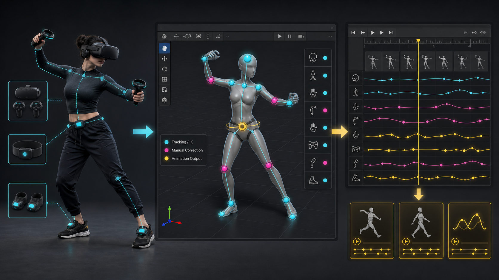
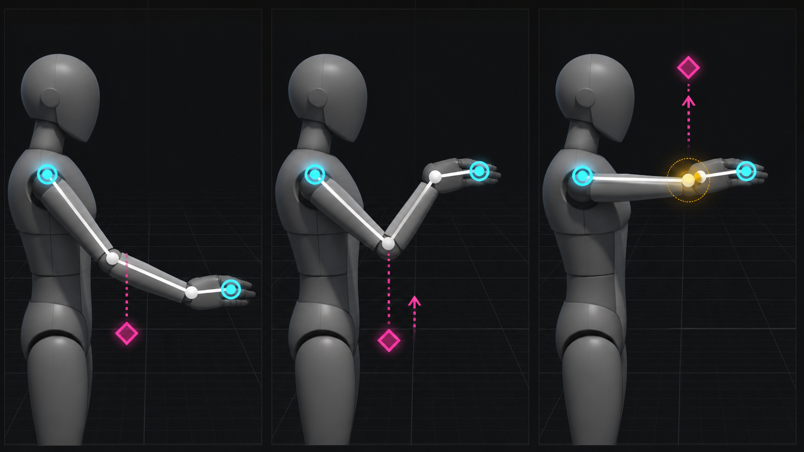

# 導入・記録・レビューガイド

このガイドでは、Motion Take Studio 0.1.1 を VPM またはローカルパッケージとして導入し、
OpenVR の姿勢を記録して、Scene View で補正し、クリップへ書き出すまでを説明します。



> この画像は記録から補正・Clip 出力までの概念図です。右側のカーブ表示は Unity の
> Animation Window を表しており、Motion Take Studio 独自の Curve Editor ではありません。

## 1. インストール

### VCC / VPM（推奨）

1. VCC の **Settings > Packages** を開きます。
2. `https://chanyavrc.github.io/MotionTakeStudio/index.json` を Repository として追加します。
3. 対象プロジェクトの **Manage Project** を開きます。
4. **Motion Take Studio** を追加します。
5. Unity でプロジェクトを開き、Console にコンパイルエラーがないことを確認します。

### ローカル開発

1. Unity 2022.3 以降でプロジェクトを開きます。
2. **Window > Package Manager** を開きます。
3. 左上の **+** から **Add package from disk...** を選びます。
4. `com.buildsoft.motion-take-studio/package.json` を指定します。
5. Console にコンパイルエラーがないことを確認します。

Unity Animation Rigging 1.2.1 は依存関係として解決されます。NDMF は任意で、自動導入されません。
NDMF と **Apply on Play** を安全に利用でき、完了通知を受け取れる場合は、一時 Clone に
`AvatarActivator` を追加して処理後の Avatar を収録します。NDMF がない、Apply on Play が無効・
確認不能、または安全に開始できない場合は、通常の Humanoid Clone で Capture を続行します。
一度任意処理を開始した場合は、処理途中の Root を収録しないよう完了通知まで Ready にしません。

既定の Tracker Provider を使う場合は、SteamVR Unity Plugin を導入して SteamVR を起動します。
OpenVR がなくてもパッケージ自体はコンパイルできますが、既定 Provider では録画を開始できません。
独自の `ITrackerPoseProvider` を注入すればトラッキング側の OpenVR 要件だけを置き換えられます。
どの Provider でも Record 開始時に有効な Head／LeftHand／RightHand が必要です。

## 2. ウィンドウを開く

**Tools > BuildSoft > Motion Take Studio** を選びます。

`Humanoid Animator` には Prefab アセットではなく、現在のシーン上に存在する
`Animator` を指定します。`Animator.avatar` が有効で Humanoid でなければ開始できません。

## 3. トラッカーのロール

利用できるロールは次の 11 種類です。

- Head
- LeftHand / RightHand
- Waist / Chest
- LeftFoot / RightFoot
- LeftKnee / RightKnee
- LeftElbow / RightElbow

HMD は Head、OpenVR の左右コントローラーは LeftHand / RightHand として認識されます。
Generic Tracker は、未使用ロールへ次の順で暫定割り当てされます。

`Waist → LeftFoot → RightFoot → Chest → LeftKnee → RightKnee → LeftElbow → RightElbow`

この順序は身体への装着位置を判定した結果ではありません。たとえば HMD＋左右コントローラー＋
3 台の Generic Tracker は Waist／LeftFoot／RightFoot の暫定ロールになります。ただし
デバイス列挙順は装着位置を保証しないため、必ず確認してください。

3 点では Head と両 Hand、代表的な 6 点ではさらに Waist と両 Foot を使用します。11 点まで
同じ Role API で扱えますが、点数だけでは Record 可否を判定しません。最低条件は有効な
Head／LeftHand／RightHand で、追加 Role は任意です。

Play Mode の **Ready** 後に **Refresh Tracked Devices** を押し、各シリアル番号のロールを
ドロップダウンで設定してください。API からは `ITrackerPoseProvider.AssignRole` も利用できます。
具体例は [API・データモデル](APIReference.md#トラッカープロバイダー)にあります。

## 4. Play Capture

1. Edit Mode で対象の Humanoid `Animator` を選びます。
2. Lyuma Av3 Emulator や Gesture Manager が有効なら停止します。既知のクローン競合が
   見つかると、Motion Take Studio は Capture を開始しません。
3. **Prepare Play Capture** を押します。
4. ツールが一時的な additive Scene とアバターの Clone を作ります。任意の NDMF Apply on Play を
   安全に開始できる場合だけ `AvatarActivator` を追加し、それ以外は通常 Clone を使います。
5. 状態が **Ready** になるまで待ちます。任意処理を開始した場合は完了通知後、通常 Clone の場合は
   そのまま、再取得した Animator と必要な Humanoid Bone が 2 フレーム連続で安定すると Ready になります。
6. **Record** を押します。HumanPose とトラッカー姿勢は 60 Hz で記録されます。
7. 動きを終えたら **Stop & Review** を押します。

少なくとも 1 フレームを記録してください。0 フレームの Take は AnimationClip に
ベイクできません。また、Recording 中はレビュー用スライダーを操作せず、
Stop & Review 後にスクラブしてください。

短く、前後を有効サンプルで挟まれたトラッキング欠落は補間されます。既定では
100 ms を超える欠落や、開始・終了側が欠けた欠落は補間せず警告になります。

## 5. Review とオーバーレイ

Review では `Frame` スライダーでフレームを移動し、検証項目をクリックすると該当フレームへ
ジャンプできます。Stop & Review 直後から末尾フレームが Scene View へ反映されます。

Scene View の表示切り替えは次のとおりです。

- **Raw**: 接続・有効・キャリブレーション済みの生トラッカー姿勢
- **IK**: Tracker を Humanoid へ解決した直後。Filtering、Root Jump 補正、Foot Lock の前
- **Auto**: Filtering、Root Jump 補正、Foot Lock を適用した記録済み HumanPose
- **Manual**: Auto に Recipe を適用した後の、Clamp を含む実際の Solver 結果

Raw は対応ロールのサンプルがない場合、またはトラッカーが無効な場合には表示されません。
IK、Auto、Manual は別々のステージ Pose から描画されます。自動補正が働かなかったフレームでは
IK と Auto、Recipe 差分がないフレームでは Auto と Manual が結果として重なることがあります。

## 6. ポーズ補正

選択できるターゲットは 10 個です。

- Head / Hips
- LeftHand / RightHand
- LeftFoot / RightFoot
- LeftElbowHint / RightElbowHint
- LeftKneeHint / RightKneeHint

Head、Hips、Hands、Feet には位置と回転のハンドルがあります。ElbowHint と KneeHint は
位置のみです。補正位置はアバター Root のローカル空間で正規化され、通常ターゲットは
`humanScale`、肘・膝 Hint は対応する Limb 長で除算して Recipe に保存されます。

`Influence (frames)` は 1〜60、既定値は 12 です。キーの前後へ Smoothstep で影響し、
重なるキー同士は補間されます。

Scene View のハンドルを動かすと、そのフレームの補正キーが直ちに作成または更新されます。
**Add Pose Key** は指定フレームで評価中の選択ターゲット差分を明示的なキーとして保存し、
Influence 値を設定します。差分がない場合もゼロ差分のアンカーキーを作成します。

- **Reset Target**: 現在フレームの選択ターゲット補正を削除
- **Delete Key**: 現在フレームのキー全体を削除
- **Undo / Redo**: Recipe に記録された Editor Undo を実行

### 肘 Hint の補正



> この画像は Hint と Bend Plane の関係を示す概念図です。実際の Solver では、到達可能な Pose の
> Shoulder と Hand Target を固定し、Elbow の曲がる方向を変更します。

1. Review で問題のフレームへ移動します。
2. Target を `LeftElbowHint` または `RightElbowHint` にします。
3. Scene View の位置ハンドルを、望む肘の曲げ方向へ移動します。
4. 到達可能な範囲では、Two-Bone IK が Hand の目標位置を固定したまま Bend Plane を変えます。
5. Hand が動く、または警告が表示される場合は、Hint や Hand の補正量を小さくしてください。

同じ手順を KneeHint と Foot に使えます。Solver は到達不能な目標を Clamp し、警告を
返します。Avatar に明示された HumanBone の軸レンジは対応する肘・膝の曲げ上限へ反映されます。

### Head と Hips の注意

Head 位置は Spine から Neck の反復解決、Head 回転は補正差分の分配を行います。Hips 補正は
Hips Bone を直接補正し、両足を記録済みのベース位置へ固定して脚を再解決します。接地判定や
Animator Root の直接補正ではありません。最終クリップは HumanPose の Muscle と Root カーブから
作るため、大きな補正はプレビューと完全に一致しない場合があります。
書き出した Corrected クリップを必ず対象アバターで確認してください。

## 7. 検証

Stop & Review 時に検証が走り、問題はフレーム付きのボタンとして表示されます。
標準 Capture で確認される主な項目は次のとおりです。

- NaN / Infinity を含む姿勢
- 1 サンプル間の Root の急変（`humanScale` を反映したメートル単位）
- トラッキング欠落
- 床貫通と、接地中の足滑り
- Capture／Manual IK の到達不能や不正入力に由来する警告
- 肘・膝の Bend Direction が 1 サンプルで大きく反転する Joint Flip

Recipe を編集すると、Manual 補正後の全フレームを先頭から順に再評価します。床貫通と足滑りは
補正後 Humanoid の左右 Foot Bone 位置と Capture Rig の接地高さ、Joint Flip は前後フレームの
Bend Direction、IK 警告は発生した各フレームへ紐づけます。検証後は編集前のスクラブ位置へ戻ります。

## 8. 保存と書き出し

**Save & Exit** は次の処理を行います。

1. `.mttake` を `Assets/MotionTakeStudio/Takes` に一意名で保存
2. Recipe、検証項目、補正済み HumanPose を Pending Export として保持
3. Play Mode を終了
4. Edit Mode で Take を Import
5. Recipe、Validation Report、Auto／Corrected／Manual クリップを生成

クリップは空パスの `Animator` カーブとして、`HumanTrait.MuscleName` の全 Muscle と
`RootT.x/y/z`、`RootQ.x/y/z/w` を持ちます。Recipe とクリップは `_vNN` の未使用番号を選び、
既存アセットを上書きしません。サンプル間の Muscle／Root 成分は Linear Tangent で補間されます。

Manual は Corrected のコピーです。自動では Animation ウィンドウを開かないため、
Project View で Manual クリップを選び、**Assets > BuildSoft > Open Clip in Animation Window**
を実行してください。

## 9. Recovery

記録中は append-only の JSON Lines Journal が
`Library/MotionTakeStudio/Recovery` に作成され、約 0.5 秒ごとに Flush されます。
末尾の 1 行がクラッシュで途中までしか書かれなかった場合、その行を無視して読み込めます。

Stop & Review 後は、Capture、Recipe、スクラブ位置を含む `.review-checkpoint.json` も原子的に
更新されます。Play Mode 中の Assembly Reload 後は、収録用 Humanoid を再バインドして Review を
復元します。正常な Save & Exit 後は Checkpoint を `Completed` へ移します。

正常な Save & Exit では Journal が `Archived` 側へ移されます。Edit Mode での書き出し用には、
同じ Recovery フォルダーへ `.pending-export.json` も作成され、書き出し成功後に `Completed` へ
移動します。

現行版には Recovery 一覧・復元 UI がありません。`MotionTakeRecovery.FindAll` と
`MotionTakeRecovery.TryLoad` を Editor スクリプトから利用できます。元ファイルを手動で
削除する前にバックアップしてください。

## 10. 自動テスト（開発者向け）

テストは用途ごとに 2 assembly へ分けています。

- **EditMode — `BuildSoft.MotionTakeStudio.Editor.Tests`**: 補正、IK、Validation、Clip、Recovery、
  Asset 書き出しなど、Runtime と Editor の両方へまたがる処理を検証します。この assembly には、
  Editor から Play Mode へ遷移し、生成 Humanoid の 6 点 Capture から Review、左肘 Hint の
  10 cm 補正、Validation、Clip 再生までを通す E2E `[UnityTest]` も含まれます。
- **PlayMode — `BuildSoft.MotionTakeStudio.PlayMode.Tests`**: Editor の Play Mode へ実際に入り、
  Runtime Component と複数 Player frame にまたがるライフサイクルを検証します。

Unity 2022.3.22f1 での確認結果は、Editor suite が **95 / 95**、Runtime PlayMode suite が
**2 / 2** です。

### Package のテストを表示する

`Packages/com.buildsoft.motion-take-studio` に置いた embedded package は開発中 package として
自動的にテスト対象になります。`Add package from disk...`、Git URL、registry などから導入した
非 embedded package のテストは、導入先プロジェクトの `Packages/manifest.json` で明示的に
有効化してください。`testables` は `dependencies` と同じルート階層へ置きます。

```json
{
  "dependencies": {
    "com.buildsoft.motion-take-studio": "file:../com.buildsoft.motion-take-studio"
  },
  "testables": [
    "com.buildsoft.motion-take-studio"
  ]
}
```

変更直後に表示されない場合は package を再 Import するか、Unity を開き直してください。

### Test Runner GUI

1. **Window > General > Test Runner** を開きます。
2. **EditMode** タブで `BuildSoft.MotionTakeStudio.Editor.Tests` を実行します。
3. **PlayMode** タブで `BuildSoft.MotionTakeStudio.PlayMode.Tests` を実行します。
4. PlayMode run が実際に Play Mode へ入り、Editor が 95 件、PlayMode が 2 件、かつ全件成功する
   ことを確認します。

### CLI / CI

プロジェクトルートから [Run-MotionTakeStudioTests.ps1](../Tools~/Run-MotionTakeStudioTests.ps1) を
実行します。すべてのパラメーターは任意です。

```powershell
pwsh -File "Packages/com.buildsoft.motion-take-studio/Tools~/Run-MotionTakeStudioTests.ps1" `
  -UnityPath "C:/Program Files/Unity/Hub/Editor/2022.3.22f1/Editor/Unity.exe" `
  -ProjectPath "." `
  -ResultsDirectory "Library/MotionTakeStudio/TestResults" `
  -TestTimeoutMinutes 15
```

`UnityPath` を省略すると、runner は `UNITY_PATH`、`ProjectVersion.txt` に対応する標準 Unity Hub
配置、PATH 上の Unity の順に探します。`ProjectPath` の既定値は package を含む Unity project、
`ResultsDirectory` の既定値は `<Project>/Library/MotionTakeStudio/TestResults` です。
`TestTimeoutMinutes` は各 Unity process の上限時間で、既定 15 分、指定範囲は 1〜120 分です。

`Add package from disk...` の参照先が Unity project の外にある場合も、外部 package 内の runner へ
`-ProjectPath "<導入先 Unity project>"` を渡せば実行できます。非 embedded package では、先に
導入先の `Packages/manifest.json` へ `testables` を設定してください。

Unity を起動せず、runner の XML 判定契約だけを確認する場合は `-SelfTest` を使います。

```powershell
pwsh -File "Packages/com.buildsoft.motion-take-studio/Tools~/Run-MotionTakeStudioTests.ps1" -SelfTest
```

通常実行でもこの自己テストは Unity 起動前に毎回実行され、正常 XML、XML 欠落・破損、0 件、
failed／skip／inconclusive、対象 assembly 不一致、対象 assembly の失敗、必須 test 不在の fixture を
使って false green 防止を確認します。

runner は同一 project に対して EditMode と PlayMode を別の Unity process で逐次実行し、各 process の
exit code、timeout、assembly load／compile error、NUnit XML を検査します。run と対象 assembly の
`total` が一致し、対象 assembly 自身の `total > 0`、`passed == total`、
`failed == skipped == inconclusive == 0`、`result == Passed` を満たす必要があります。さらに次の
test fullname が XML 内で `Passed` でなければ失敗します。

- `BuildSoft.MotionTakeStudio.Editor.Tests.MotionCapturePlayModeIntegrationTests.CaptureReviewElbowCorrectionValidationAndBake_RoundTripsAcrossPlayerFrames`
- `BuildSoft.MotionTakeStudio.PlayMode.Tests.MotionTakeRuntimePlayModeTests.MotionCaptureAvatarMarker_ConfigurePersistsAcrossTheNextPlayerFrame`
- `BuildSoft.MotionTakeStudio.PlayMode.Tests.MotionTakeRuntimePlayModeTests.TwoBoneIkSolver_ReachesMovingTargetAcrossRealPlayerFramesWithoutFlipping`

Unity は `-nographics` で起動するため、GPU のない CI agent でも同じ入口を利用できます。CI では結果
XML と `.log` を artifact として保存してください。
同じ project を複数 job から同時に開かず、並列化する場合は checkout と `ProjectPath` を job ごとに
分けます。

コマンドへ `-quit` や `-runSynchronously` を追加しないでください。`-runTests` は完了時に終了し、
`-runSynchronously` は複数 frame を使う `[UnityTest]` を対象外にするためです。

### 実機 Integration は別に確認する

自動 PlayMode suite は Runtime の Player loop を確認しますが、SteamVR／OpenVR の実デバイス列挙、
トラッカーの装着ロール、任意の NDMF Apply on Play、MA／VRCFury を含む実アバターの処理結果を保証しません。
リリース候補では、自動テストに加えて本書の **Play Capture** を対応 HMD、3／6／11 点構成、
対象アバターで実行し、Ready、Record、Review、Save & Exit を別の実機検証として確認してください。

次: [トラブルシューティング](Troubleshooting.md) / [API・データモデル](APIReference.md)
